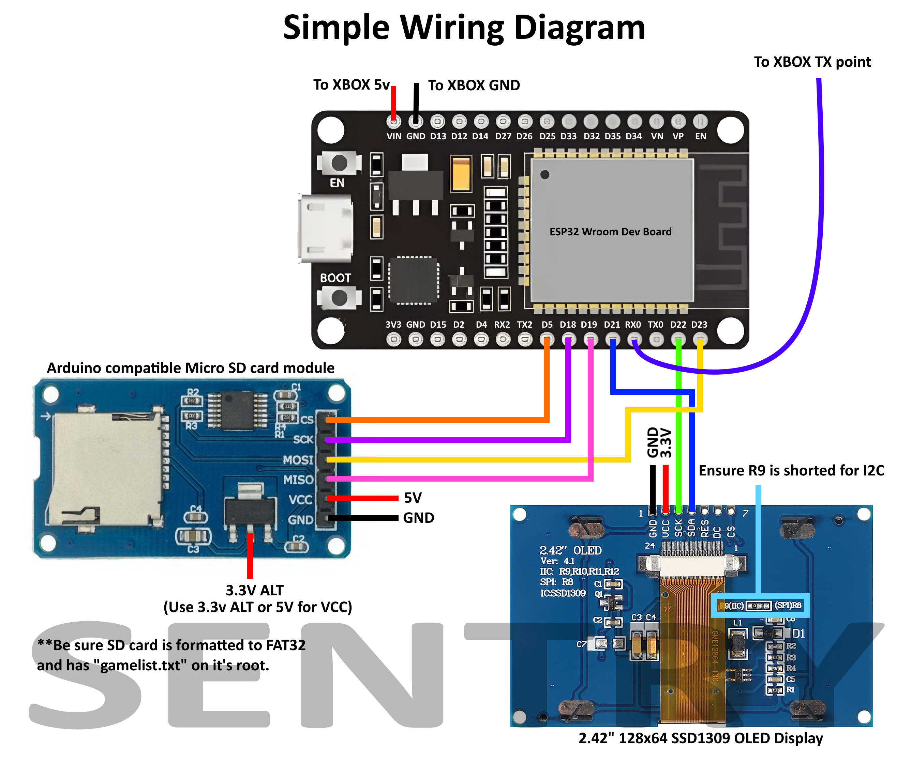

ADDED 3/16/2025: SentrySync4 files. Functionality for 2 seperate screens added. Sorted things a little. 

ADDED 3/13/2025: Both TFT and OLED setups for wireless SentrySync. 
ADDED 3/9/2025: SentrySync can now be remote and wireless running even on batteries!
ADDED 3/6/2025: SentrySync is now in Full Color! New files and diagram added.
ADDED 2/24/2025: SentrySync2.ino and SentrySync3.ino work with wifi. 
SentrySync3.ino adds Over-The-Air update capabilities for uploading a sketch to ESP32 wirelessly.
Updated diagram.
Thanks to ViolentLambs and Charly Gaber for helping out with this. Check out Charly's Fiver account. He does great work! 

# Sentry
Sentry is a project I started as a fun experiment to bring a status screen to the Xbox 360, inspired by the old LCD mods for the original Xbox. Currently, the project is unfinished however, it does have a handful of features in its current state, including:  

- **Temperature Monitoring**: Actively updates and displays the consoles current temperature readings.
- **Network Information**: Displays the console's IP address when connected via Wi-Fi or LAN. 
- **Title ID and Game Data**: Reports the active Title ID and its related game information.   
- **Debugging Mode**: Ability to switch into a uart mode to monitor all data transmitted over serial, useful for general Xbox 360 development and debugging.

All of this is done via a dashlaunch plugin that reports this information to the OLEDs controller

## Sub-Projects  

- **Sentry Plugin**: A DashLaunch plugin that handles all the reporting.  
- **Sentry Sample**: A sample XEX project to demonstrate mode switching.  
- **Sentry Sync**: The main controller project that parses the transmitted data and displays it on the OLED. 
  
I eventually lost interest and shelved the project, but this should make for a great starting point for anyone looking to build upon these ideas.  

### Demo Video:  

## Parts Search List

- **OLED Display**: 2.42" 128x64 SSD1309 OLED Display  (any i2c OLED should work, refer to wiring)
- **ESP32-­WROOM-­32**: ESP-WROOM-32 Dev Board
- **SD Module**: Arduino compatible Micro SD card module

## Simple Wiring Diagram -- UPDATED

# SentrySync - Full Color

